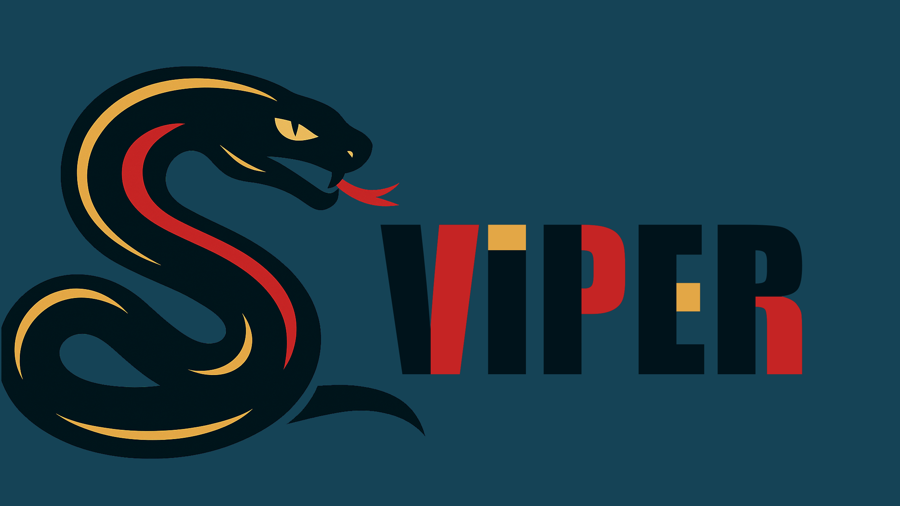

---

Это язык, разширяющий возможности экосистемы Python, к тому-же работает на CPytohn (позже будет поддерка Pypy)
И это форк языка Watt (его скелет). Ссылка на автора: https://github.com/vyacheslavhere/watt
Этот язык находиться в стадии разработки и напишу нормальный README после написания MVP
